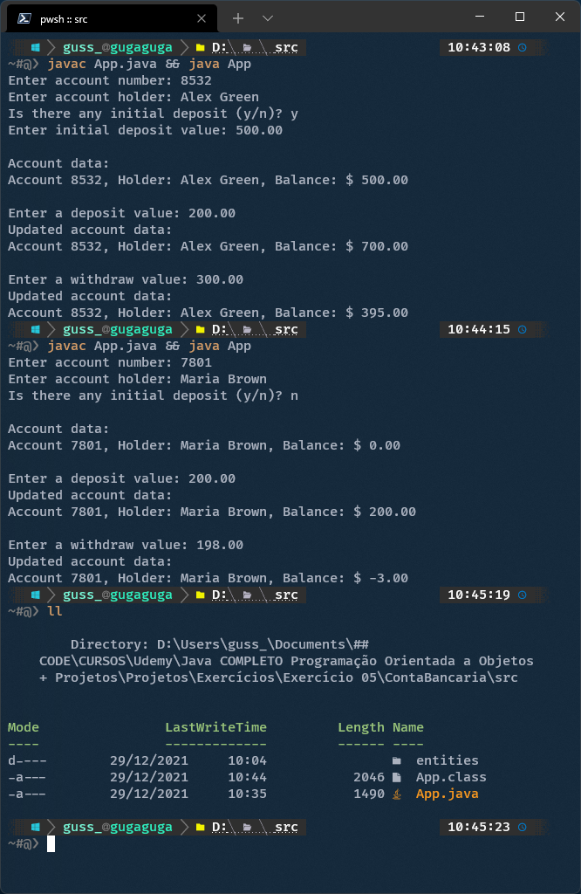

# Curso Java Completo - Programação Orientada a Objetos - Udemy

## Exercício 5

Em um banco, para se cadastrar uma conta bancária, é necessário informar o número da conta, o nome do titular da conta, e o valor de depósito inicial que o titular depositou ao abrir a conta. Este valor de depósito inicial, entretanto, é opcional, ou seja: se o titular não tiver dinheiro a depositar no momento de abrir sua conta, o depósito inicial não será feito e o saldo inicial da conta será, naturalmente, zero.

Importante: uma vez que uma conta bancária foi aberta, o número da conta nunca poderá ser alterado. Já o nome do titular pode ser alterado (pois uma pessoa pode mudar de nome por ocasião de casamento, por exemplo).

Por fim, o saldo da conta não pode ser alterado livremente. É preciso haver um mecanismo para proteger isso. O saldo só aumenta por meio de depósitos, e só diminui por meio de saques. Para cada saque realizado, o banco cobra uma taxa de $ 5.00. Nota: a conta pode ficar com saldo negativo se o saldo não for suficiente para realizar o saque e/ou pagar a taxa.

Você deve fazer um programa que realize o cadastro de uma conta, dando opção para que seja ou não informado o valor de depósito inicial. Em seguida, realizar um depósito e depois um saque, sempre mostrando os dados da conta após cada operação.

## Exemplo:

## Sobre mim

### Hi there 👋

I'm Gustavo Siqueira, a.k.a Guga. I'm here to share code with the world!

- 🌱 I’m currently learning front-end 🌎 Web Development: HTML | CSS | JavaScript.
- 🦾 I’m currently learning back-end : ☕ Java | 🐍 Python.
- 📫 How to reach me: guss.ns@gmail.com

  <a href="https://github.com/siqueira-gustavo">
  
  

 
  
  
  
  
  
  
  
  
  
  
  
  

##
 

 
  
   

  <!--  -->
 

